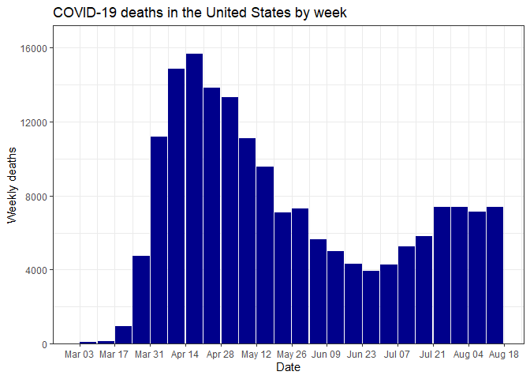
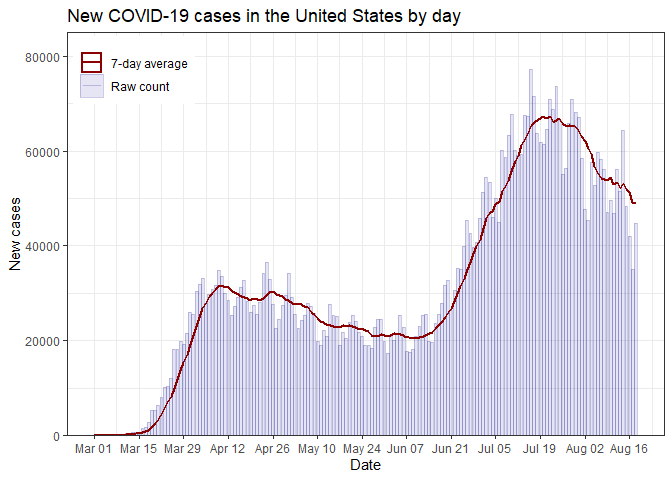
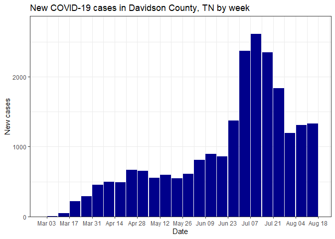
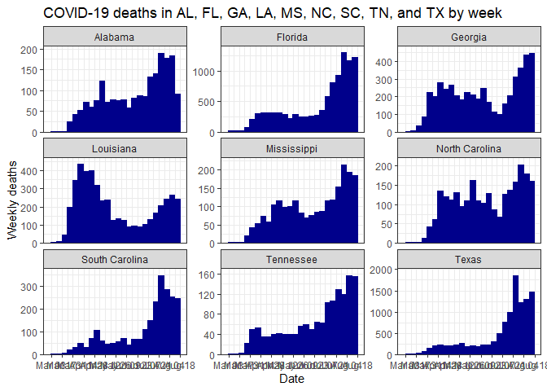
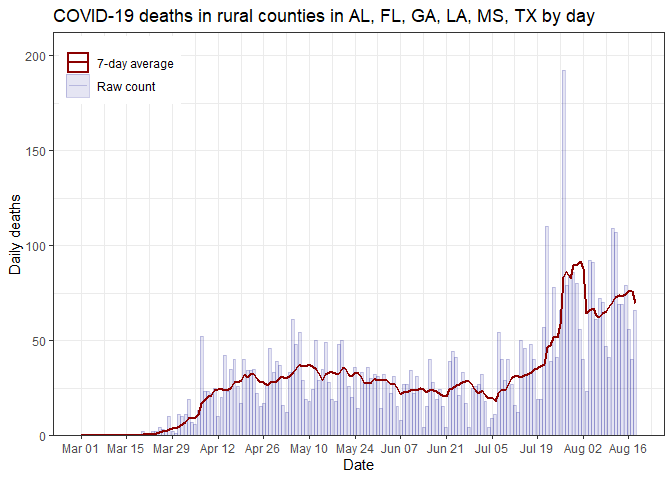

COVID Data Analysis
================
Jonathan Gilligan

# covid-data

<!-- badges: start -->

<!-- badges: end -->

## Description

This is a collection of R scripts that I use for plotting daily and
weekly COVID-19 data (case counts and deaths) for counties in the United
States. These scripts use the data collected and curated by the Johns
Hopkins Center for Systems Science and Engineering (CSSE), which the
Center kindly makes available at
<https://github.com/CSSEGISandData/COVID-19>.

To use these scripts, initialize by running the function `startup()`,
which downloads the latest data from GitHub and prepares it for use. You
can get data for one or more states or counties with `select_data()` or
`rural_data()`.

  - `select_data()` allows you to specify one or more states or one or
    more counties within a single state. If you call it with no
    arguments, it will return data for the whole US.

  - `rural_data()` allows you to look at data only from rural counties
    in one or more states.

  - I plot data using `plot_time_series()`, which has a number of
    options to control the way that the data is plotted.

## Examples

Plot weekly COVID-19 deaths for the whole US:

``` r
select_data() %>% plot_time_series("deaths")
```

<!-- -->

Plot daily new cases for the whole US

``` r
select_data() %>% plot_time_series("cases", weekly = FALSE)
```

<!-- -->

Plot weekly case data for a single county (Davidson County, TN)

``` r
select_data("TN", "Davidson") %>% plot_time_series("cases", weekly = TRUE)
```

<!-- -->

Make a facet plot for multiple states:

``` r
select_data(c("TX", "LA", "MS", "AL", "FL", "GA", "SC", "NC", "TN")) %>%
  plot_time_series("deaths", facet = TRUE)
```

<!-- -->

Make a plot for rural counties in several states:

``` r
rural_data(c("TX", "LA", "MS", "AL", "FL", "GA")) %>%
  plot_time_series("deaths", weekly = FALSE)
```

<!-- -->
